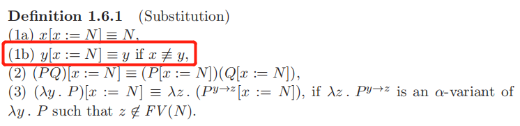

# 无类型的 λ-演算（calculus）

## 疑惑

### 1

x 和 y 什么时候句法等同？

## 函数的本质（essence）

在 λ-calculus 中，函数被表示为如 $λx. x^2 + 1$ 的形式，. 的右边是表达式，λx 表示在表达式中 x 是一个变量，同时 x 是该函数的形参。在函数调用时，传入的值跟随在函数之后以括号包裹，如 $(λx. x^2 + 1)(3)$。

总结出两个构造原则（construction principles）和一个求值规则（evaluation rule）：

### 构造原则

1. 抽象（Abstraction）：由表达式 M 和变量 x 可以构造得到一个新的表达式：$λx. M$，称之为 M 上 x 的抽象。
2. 应用（Application）：由表达式 M 和 N 可以构造表达式 $M N$，称之为 M 应用于 N。

> 函数 $λx. x^2$ 中，表达式 $x^2$ 不是一个函数，而是一个抽象的输出值，表示 x 的平方。与函数的区别在于，假设 x 是一个自然数，函数 $λx. x^2$ 接收自然数返回自然数，而 $x^2$ 表示一个自然数。

### 求值规则

函数求值的过程的形式化称为 β-规约（β-reduction），使用替换（substitution）来进行计算，由中括号进行表示，如表达式 $M\left[x := N\right]$ 表示 M 中的 x 被替换成 N。

β-规约：形如 $(λx. M)N$ 的表达式可以被重写为表达式 $M\left[x := N\right]$，表达式 M 中的每一个 x 都会被替换成 N，从 $(λx. M)N$ 到 $M\left[x := N\right]$ 的过程记为 β-规约。

### 多参数

本书中，只考虑单参数的函数，在函数需要多个参数时，可以通过柯里化，使用单参数函数的复合来模拟多参数函数，如函数 $λ(x, y). (x^2 + y)$ 可以柯里化为函数 $λx. (λy. (x^2 + y))$，即为函数 g，在求值时，可以通过形如 $g(3)(5)$ 的方式来进行应用。

## λ-项（terms）

λ-演算中主要关心的部分是以最简单，最抽象的视角描述函数的行为，可以不考虑数，以及和数有关的操作，如加法等，剩下的部分为：

1. 变量（x, y, ...）
1. 构造原则，抽象和应用
1. 求值规则，β-规约

### $\Lambda$

λ-演算中的表达式被称为 λ-项，所有 λ-项的集合 $\Lambda$ 可以通过归纳的定义来构造，首先假设存在一个无限的变量集合 V，$V = \{x,y,z,...\}$。

$\Lambda$ 的定义：
1. （变量）如果 $u \in V$，那么 $u \in \Lambda$
1. （应用）如果 M 和 N $\in \Lambda$，那么 $(M N) \in \Lambda$
1. （抽象）如果 $u \in V$ 以及 $M \in \Lambda$，那么 $(λu. M) \in \Lambda$

$\Lambda$ 以抽象语法的定义为：$\Lambda = V|(\Lambda\Lambda)|(\lambda V.\Lambda)$。

### λ-项的表示

1. 使用字母 x, y, z 以及它们使用下标（subscript）和上标符（prime，′）的变体来表示 V 中的变量
1. 使用 L, M, N, P, Q, R 以及它们的变体来表示 $\Lambda$ 中的元素
1. 使用符号 $\equiv$ 表示两个 λ-项句法等同

> 所以 $(x\ z) \equiv (x\ z)$，但是 $(x\ z) \not \equiv (x y)$，需要注意的是，$M \equiv N$ 表示 M 和 N 代表的实际的 λ-项句法等同。

### 子项

记 $Sub(M)$ 为 M 中的子项的多重集（multiset），即相同的子项可以出现多次。Sub 的定义为：

1. （基础）$\forall x \in V. Sub(x) = \{x\}$
1. （应用）$Sub((M N)) = Sub(M) \cup Sub(N) \cup \{(MN)\}$
1. （抽象）$Sub((\lambda x.M)) = Sub(M) \cup {(\lambda x.M)}$
   
如果 $L \in Sub(M)$，记 L 为 M 的一个子项。如 $Sub((\lambda x. (xx))) = \{((\lambda x. (xx)), xx, x, x\}$，其中 x 出现了两次，一次是 xx 中的第一个 x，一次是 xx 中的第二个 x。

#### 引理（lemma）

1. （自反性，reflexivity）$\forall M \in \Lambda. M \in Sub(M)$
2. （传递性，transitivity）由 ${L \in Sub(M)} \land {M \in Sub(N)}$ 可以得到 $L \in Sub(N)$

#### 真（proper）子项

如果 ${L \in Sub(M)} \land {L \not \equiv{M}}$，那么 L 是 M 的真子项。

### 省略括号

1. 最外层的括号可以省略：$MN \equiv (MN)$
2. 应用是左结合的：$MNL \equiv ((MN)L)$
3. 应用的优先级高于抽象：$\lambda x.MN \equiv \lambda x.(MN)$
4. 同一 λ 后出现的抽象是右结合的：$\lambda xy.M \equiv \lambda x. (\lambda y. M)$

## 自由和约束（bound）变量

出现在 λ-项中的变量可以被分成三种：自由（free），约束（bound）和绑定（binding）。

1. 绑定变量，指直接出现在 λ 之后的变量
2. 约束变量，指出现在表达式中的绑定变量，如 $\lambda x. xy$ 中的第二个 x
3. 自由变量，指出现在表达式中的非绑定变量，如 $\lambda x. xy$ 中的 y

### FV(L)

FV(L) 表示 λ-项 L 中的自由变量的集合，其定义为：
1. （变量）$FV(x) = \{x\}$
2. （应用）$FV(MN) = FV(M) \cup FV(N)$
3. （抽象）$FV(\lambda x. M) = FV(M) \ \{x\}$

> 需要注意，$FV(x(\lambda x.xy)) = \{x, y\}$，尽管其中 x, y 都是自由变量，但是自由变量的 x 是 $x(\lambda x.xy)$ 中的第一个 x，而 y 之前的 x 依然是约束变量。

### 组合子（combinator）

如果一个 λ-项 M 满足 $FV(M) = \emptyset$，称 M 是闭合的（closed），也可以将其称为是一个组合子。所有组合子的集合用 $\Lambda^0$ 表示。

## α-变换（conversion）

λ-项中的绑定变量并不是必须的，如平方函数可以写作 $\lambda x. x^2$，也可以写作 $\lambda u. u^2$，都表示函数计算传入值的平方之后将得到的值作为输出值。变量名只是为了给传入的值提供一个临时的名字。因此在 λ-演算中，只有绑定变量（以及对应的约束变量）不同的 λ-项是相同的。

定义关系 α-变换或 α-等价（equivalence）来形式化地描述这个过程：

令 $M^{x\rightarrow y}$ 表示将 M 中所有的自由变量 x 替换为 y，重命名的关系使用符号 $=_{\alpha}$ 表示，则当 $y \notin FV(M)$ 以及 y 不是 M 中的绑定变量时，$\lambda x. M =_{\alpha} \lambda y. M^{x\rightarrow y}$。

也即 $\lambda x. M$ 被重命名为 $\lambda y. M^{x\rightarrow y}$。

α-变换具有如下性质：
1. （相容性，compatibility）如果 $M =_{\alpha} N$，那么 $ML =_\alpha NL, LM =_\alpha LN$，并且对于任意的 z，$\lambda z. M =_\alpha \lambda z. N$
2. （自反性，reflexivity）$M =_\alpha M$
3. （对称性，symmetry）如果 $M =_\alpha N$，那么 $N =_\alpha M$
4. （传递性，transitivity）如果 $L =_\alpha M \land M =_\alpha N$，那么 $L =_\alpha N$

> 如果 $M =_\alpha N$，则 M 和 N 称为 α-可变换（α-convertible）或 α-等价（α-equivalent）。M 被记为是 N 的一个 α-变体（α-variant）。

## 替换

替换的定义如下：
1. $x[x:=N]\equiv N$
2. 如果 $x \not \equiv{y}$，那么 $y[x:=N]\equiv y$
3. $(PQ)[x:=N]\equiv (P[x:=N])(Q[x:=N])$
4. 如果 $\lambda z. P^{y\rightarrow z}$ 是 $\lambda y.P$ 的一个 α-变体，且 $z \notin FV(N)$，则 $(\lambda y. P)[x:=N]\equiv \lambda z.(P^{y\rightarrow z}[x:=N])$
